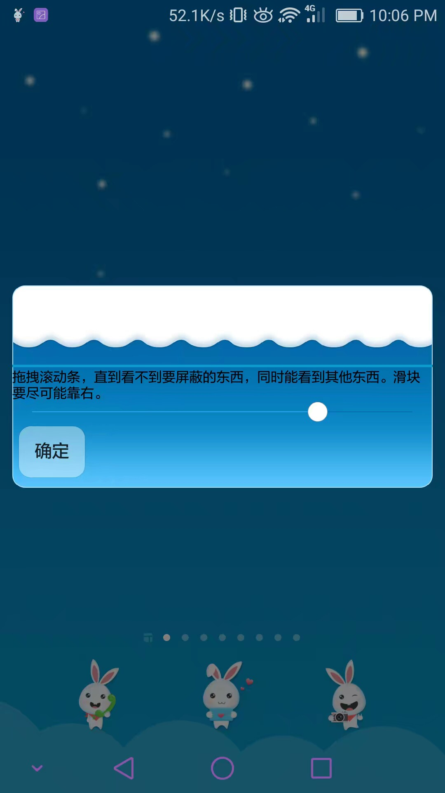

# AdBlockAndroid

This project was **discontinued** for huge impact on system performance and battery life.  

## Introduction

A screenshot is enough to show how it works.  
Press the hotkey (Vol +);  
Click on something;  
drag the bar on the popup to block *exact* what you don't what.  

It's an adblock for android using the powerful framework Xposed. It allows user to simply tap something on the screen to block it.
Notice that it do NOT block a thing in WebViews and in-game interfaces such as GLSurfaceViews.
There're many adblocks that blocks webpage advertisments already and you can use 'em.
 
## Notice that
0. This app is still far before a stable release, use under your own risk. 
1. It requires Xposed framework, if you dont know what it is you'd better not to install it that it may turn your device into a brick. 
2. All texts in this app are in Chinese now. 
3. It do not work on webpages or in games. 
4. The author is a cat, so do not expect too much. 
5. You can also be a moe cat~ Nyanpasu!
6. There's no 7.
